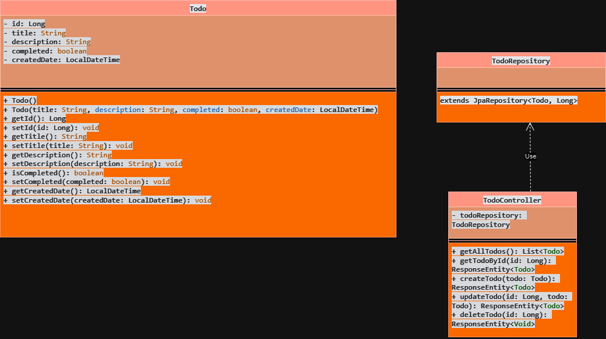
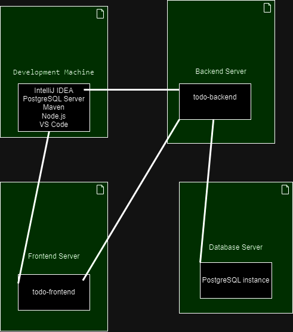
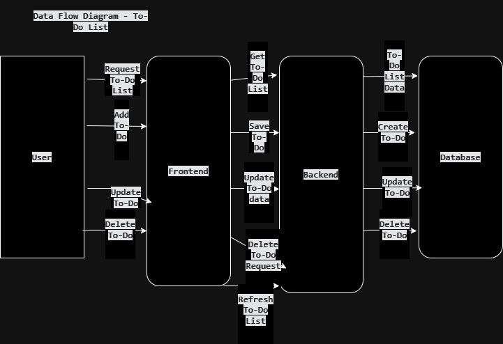

# To-Do List Microservices App

## Introduction

This project is a personal endeavor born out of my need for a simple yet effective tool to manage my tasks. As a software engineering student (or aspiring software engineer), I often found myself juggling various tasks and deadlines. Existing to-do list applications either felt too complex or lacked the specific features I wanted. This led me to embark on this journey to create a To-Do List application from scratch, utilizing a microservices architecture.

## Motivation

I wanted to gain hands-on experience with:

*   Designing and implementing a microservices architecture
*   Developing a RESTful API backend using Java and Spring Boot
*   Building a modern user interface with Angular
*   Working with a relational database (PostgreSQL)
*   Implementing a full-stack application from start to finish
*   Practicing version control using Git and GitHub

This project also serves as a practical learning exercise, allowing me to solidify my understanding of these technologies and demonstrate my ability to build a functioning application.

## Project Overview

The To-Do List Microservices App is a web-based application that allows users to manage their tasks. It features a Java-based backend microservice that handles data persistence and business logic, and an Angular frontend that provides a user interface.

### Core Functionality

The application supports the following core features:

*   **Create To-Dos:** Add new To-Do items with a title and optional description.
*   **View To-Dos:** See a list of all To-Do items, including their completion status.
*   **Mark Complete:** Mark To-Do items as completed.
*   **Edit To-Dos:** Update the title or description of existing To-Do items.
*   **Delete To-Dos:** Remove To-Do items from the list.

## Technology Stack

*   **Backend:** Java with Spring Boot
*   **Frontend:** Angular
*   **Database:** PostgreSQL
*   **Build Tool:** Maven
*   **Version Control:** Git and GitHub
*   **Documentation:** UML diagrams (draw.io)

## API Endpoints (Backend)

The backend microservice exposes the following RESTful API endpoints:

| Method | Endpoint              | Description                                      | Request Body              | Response Body                               |
| ------ | --------------------- | ------------------------------------------------ | ------------------------- | ------------------------------------------- |
| `GET`  | `/api/todos`          | Get all To-Do items                             | None                      | `List<Todo>`                              |
| `GET`  | `/api/todos/{id}`     | Get a specific To-Do item by its ID              | None                      | `Todo`                                     |
| `POST` | `/api/todos`          | Create a new To-Do item                         | `Todo` (title, description) | `Todo` (created with an ID, created_date)  |
| `PUT`  | `/api/todos/{id}`     | Update an existing To-Do item (complete, title) | `Todo` (title, description, completed)| `Todo` (updated)                           |
| `DELETE`| `/api/todos/{id}`     | Delete a To-Do item                               | None                      | `void`                                    |

## UML Diagrams

The project includes the following UML diagrams:

*   **Class Diagram:** Shows the structure of the classes, their attributes, methods, and relationships.
*   **Deployment Diagram:** Shows how the different components of the application are deployed.
*   **Data Flow Diagram:** Shows the flow of data between the frontend, backend, and database.

## UML Diagrams

### Class Diagram

### Deployment Diagram

### Data Flow Diagram

## Setup and Installation

[This section will be completed later once i have the setup process]

## Future Enhancements

[This section will be completed later once i have the project working]

## Conclusion

This project has been a valuable learning experience, allowing me to explore the intricacies of microservices architecture and full-stack development. I am eager to continue improving this application and exploring more advanced features in the future.

## Author

Oumaima Hannachi 

